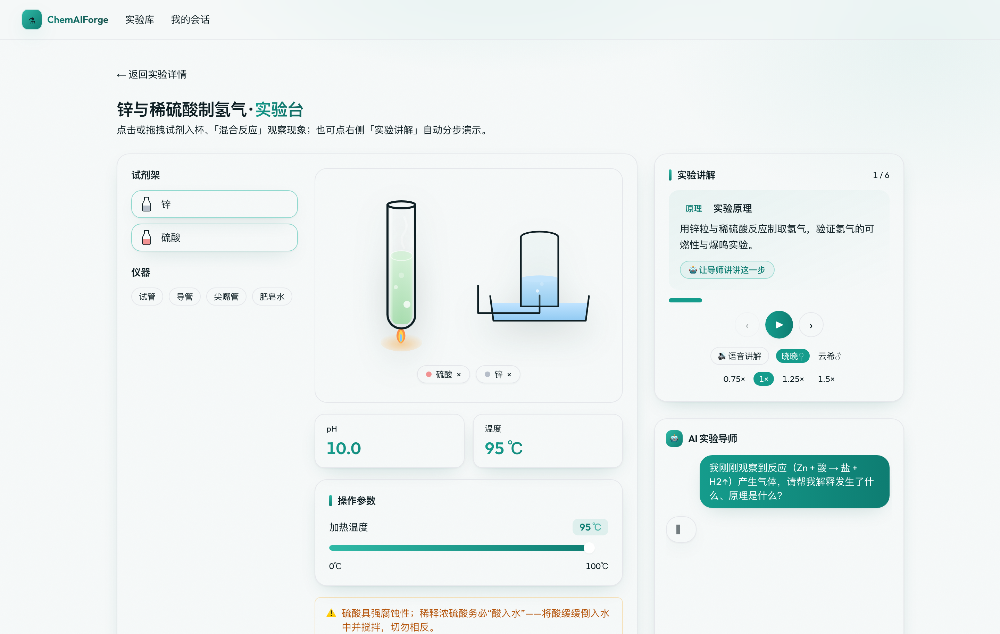

<div align="center">

# 🧪 ChemAIForge

**AI 驱动的化学虚拟实验平台**

浏览器里做化学实验：102 个真实实验、立体实验台、分步语音讲解、AI 导师与实验报告。

[](https://chem.whaty.org)
[](https://nextjs.org/)
[](https://www.typescriptlang.org/)




</div>

## ✨ 特性

- **102 个化学实验**，覆盖酸碱、氧化还原、沉淀、配位、有机、热力学、电化学等门类
- **四套纯函数化学引擎**（皆有数据驱动测试，非占位）：
  混合反应 `react` · 电解 `electrolyze` · 原电池/腐蚀 `galvanicCell` · 导电性 `conductivity`
- **真实立体实验台**：烧杯/锥形瓶/试管随仪器自动变形，特征溶液色、气泡/沉淀/蒸汽/酒精灯火焰，以及电解槽、电流计、灯泡、排水集气等专业装置
- **分步语音讲解**：edge-tts 高音质双音色（晓晓♀/云希♂）+ 倍速，讲解自动驱动器皿演示
- **AI 实验导师**：结合当前实验台状态的流式问答，关键现象自动点评
- **AI 实验报告**：依操作步骤与读数生成结论、误差分析、改进建议
- **零登录**：访客模式，打开即用

> 所有实验共享同一套数据驱动的操作界面——一处改动即覆盖全部 102 个实验。

## 🛠 技术栈

- **框架**: Next.js 14（App Router）· **语言**: TypeScript（strict）
- **样式**: Tailwind CSS · **状态**: Zustand
- **数据库**: SQLite + Prisma ORM（零配置）
- **AI**: Claude API（CC Switch 或环境变量配置）
- **语音**: Microsoft Edge TTS（离线预生成 mp3）
- **测试**: Vitest（720 用例）

## 🚀 快速开始

```bash
npm install                 # 安装依赖（postinstall 自动 prisma generate）
cp .env.example .env        # 准备环境变量
npm run db:push             # 同步 schema 到 SQLite
npm run db:seed             # 写入 102 个化学实验
npm run dev                 # 启动 (http://localhost:3000)
```

## 📁 目录结构

```
src/
├── app/                    # Next.js 页面、布局与 API 路由
├── components/lab/         # 实验台：器皿/装置/讲解/控制面板
├── lib/chem/               # 化学引擎（react / electrolyze / galvanic / conductivity）
├── data/experiments/       # 102 个实验的数据定义 + 数据驱动测试
└── server/                 # 服务端业务（experiments / session / ai）
prisma/                     # schema、seed
scripts/generate-tts.mjs    # 讲解语音预生成（edge-tts）
public/audio/lesson/        # 预生成 mp3（晓晓 / 云希两套）
```

## 🔊 讲解语音

讲解语音用 [edge-tts](https://github.com/rany2/edge-tts) 离线预生成为 mp3，前端 `<audio>` 播放，
缺失时回退浏览器 `speechSynthesis`。改了讲解文本后重新生成：

```bash
npm run tts:generate                       # 生成全部音色
npm run tts:generate -- --voice yunxi      # 仅云希
```

## 🤖 AI 配置

AI 导师与报告调用 Claude API（**严禁硬编码 Key**），按优先级读取：

1. **CC Switch**：自动读 `~/.cc-switch/cc-switch.db` 当前激活的 claude provider（可用 `CC_SWITCH_DB` 覆盖路径）
2. **环境变量兜底**：`ANTHROPIC_BASE_URL` / `ANTHROPIC_AUTH_TOKEN` / `ANTHROPIC_MODEL`

两者皆缺失时，AI 接口返回可读的配置错误提示。

## 🧪 测试

```bash
npm run test         # Vitest 720 用例（引擎规律、试剂解析、讲解生成、模式判定…）
npm run typecheck    # tsc --noEmit
npm run lint         # ESLint
```

## 📜 常用脚本

```bash
npm run build        # 生产构建
npm run start        # 生产启动
npm run db:studio    # Prisma Studio 可视化
npm run format       # Prettier
```

## License

[MIT](LICENSE)
